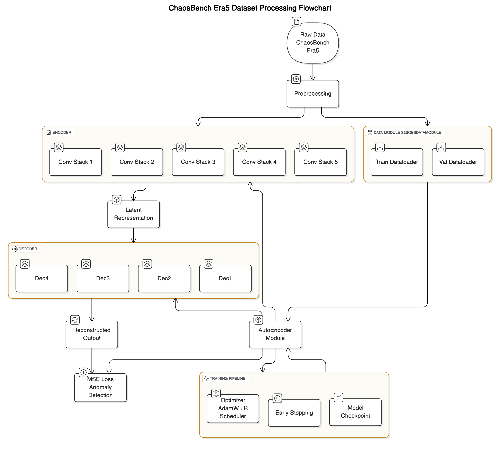

# ChaosBench Era5 Dataset Anomaly Detection

This repository contains a PyTorch Lightning-based Convolutional Variational Autoencoder for detecting anomalies in ERA5 meteorological data. The model uses convolutional layers to encode 2D spatiotemporal data and then decodes it to reconstruct the original input. By measuring reconstruction loss, anomalies or unusual patterns can be detected.

---

## Diagram

Below is a high-level flowchart of the data processing pipeline and model architecture:



1. **Preprocessing**: Takes raw ERA5 data and converts it into CSV files with the required structure.
2. **Dataset & DataModule**:
   - **S2SObsDatasetAnomaly** loads the CSV files and transforms them into PyTorch tensors.
   - **S2SObsDataModule** prepares the train and validation dataloaders.
3. **Encoder**: A stack of convolutional layers (with pooling) to compress data into a latent representation.
4. **Decoder**: A stack of transposed convolutional layers to reconstruct the original input.
5. **Autoencoder Module**: Combines the encoder and decoder, computes the reconstruction (and optionally KL) loss, and sets up the training steps.
6. **Training Pipeline**:
   - **MSE Loss (or MSE + KL for VAE)**
   - **Optimizer & LR Scheduler**
   - **Early Stopping**
   - **Model Checkpointing**

---

## Getting Started

### 1. Requirements

- Python 3.8+
- PyTorch >= 1.13
- PyTorch Lightning >= 2.0
- NumPy, Pandas, Dask, xarray, natsort, etc.

### 2. Data Setup

1. **ERA5 CSV files**: This code expects a directory structure like:
   ```
   /content/drive/My Drive/data/normalised_era5_csv/{YEAR}/{PARAMETER}_*.csv
   ```
   where:
   - **YEAR** is the year (e.g., 1984, 1985, etc.).
   - **PARAMETER** is the ERA5 variable you want to analyze (e.g., 'u', 'v', 'temperature', etc.).

### 3. Changing the ERA5 Parameter

To switch the model to train on a different ERA5 parameter, simply change the `era5_params` line in the dataset creation. For example, if you want to train on `u` instead of `v`, update:

```python
train_dataloader = S2SObsDatasetAnomaly(
    years=[1984],
    stride=20,
    era5_params=['u'],  # <--- Change parameter here
    data_path="/content/drive/My Drive/data/normalised_era5_csv"
)

val_dataloader = S2SObsDatasetAnomaly(
    years=[1985],
    stride=20,
    era5_params=['u'],  # <--- Change parameter here
    data_path="/content/drive/My Drive/data/normalised_era5_csv"
)
```

You can replace `'u'` with `'v'`, `'w'`, or any other ERA5 variable name that matches your CSV file names.

### 4. Model Description

This repository features a **Convolutional Autoencoder** (or **Variational Autoencoder**, depending on which notebook/code variant you use). The key components are:

1. **Encoder**

   - Several 2D convolutional layers with batch normalization and ReLU activation.
   - Max pooling to reduce spatial dimensions and learn a compressed latent representation.

2. **Latent Representation**

   - For the standard Autoencoder: A single compressed tensor is produced by the final encoder layer.
   - For the VAE: The encoder produces a mean (\(\mu\)) and log-variance (\(\log \sigma^2\)), and we sample a latent vector \(z\) using the reparameterization trick.

3. **Decoder**

   - Transposed convolutions to upsample back to the original spatial dimensions.
   - Batch normalization and ReLU (or Sigmoid) activations to reconstruct the input data.

4. **Loss Function**

   - **Autoencoder**: Mean Squared Error (MSE) between input and reconstruction.
   - **Variational Autoencoder**: MSE + KL divergence to enforce a latent space prior.

5. **Training**
   - Uses PyTorch Lightning for modular training steps, callbacks (e.g., EarlyStopping, ModelCheckpoint), and logging.

### 6. Results & Anomaly Detection

- Once training is complete, the model attempts to reconstruct the input fields.
- High reconstruction error may indicate anomalies or unusual patterns in the data.

## 7. ZARR to CSV Conversion Notebook

We also provide a separate notebook (filter.ipynb) that demonstrates how to convert ZARR files into CSV files. This process includes:

1. Reading the ZARR files from a specified directory.
2. Normalizing the data using precomputed mean and standard deviation.
3. Filtering the dataset to focus on a region of interest (e.g., the UK).
4. Saving each time slice as a CSV file.
